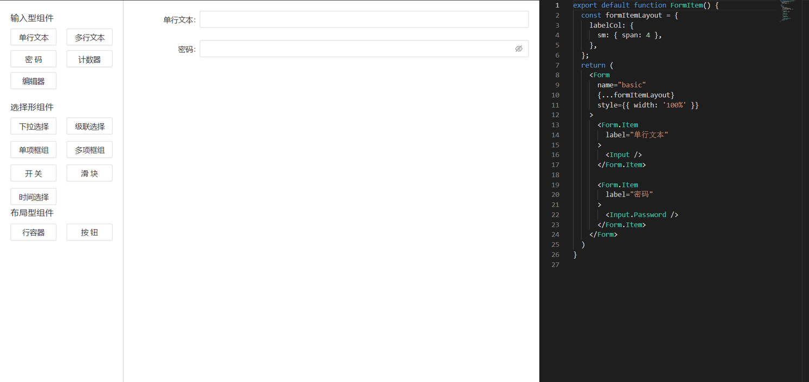
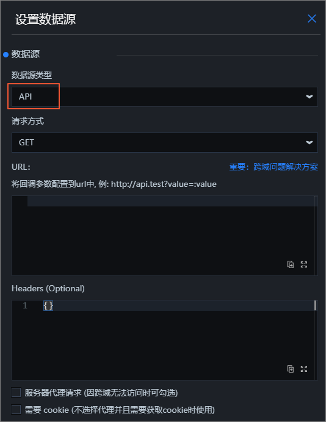
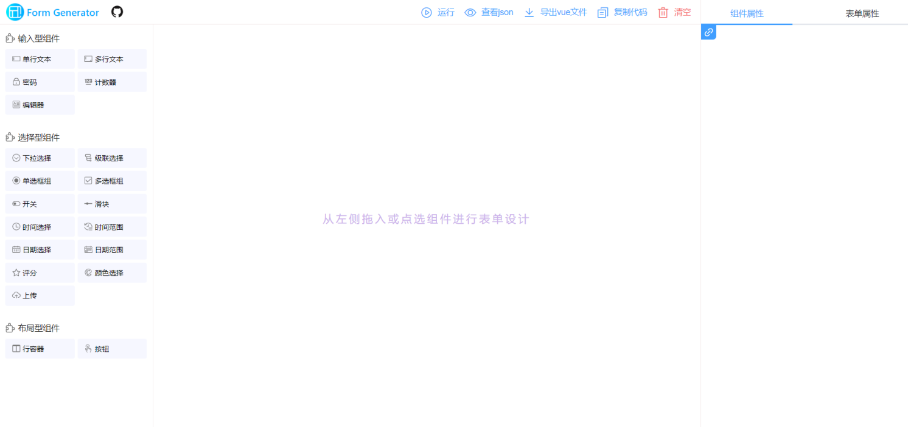

# form-generator-react

> react表单设计器

## 在线预览

[线上地址](https://wuhaohao1234.github.io/form-generator-react)

## example

## 参考

[参考示例](https://jakhuang.github.io/form-generator/#/)

这里也可以参考datav中的一些设计

### 例如

1. 可配置简单的数据源，后端服务

[文档](https://help.aliyun.com/document_detail/172986.html?spm=a2c4g.11186623.6.675.818e1cadFdj7Z9)

2. 可做简单的逻辑处理

[文档](https://help.aliyun.com/document_detail/59264.html?spm=a2c4g.11186623.6.684.2bdf61d8ooCwCI)

3. 可自定义一些样式

[文档](https://help.aliyun.com/document_detail/169802.html?spm=a2c4g.11186623.6.1002.be6eaf90vexay1)

## 示例

## 使用到的技术

antd组件库

react-monaco-editor

## 捐赠

如果您觉得本项目对您有帮助，可以请作者喝一杯咖啡, 让开源走的更远，感谢支持。

  <image style="width: 50%" src="./assets/zhifubao.jpg" />
  <image style="width: 50%" src="./assets/weixin.jpg" />

